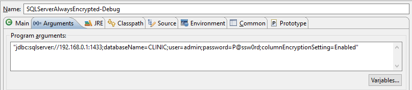

# JDBC Client. SQL Query

The [Java/SQLServerAlwaysEncrypted](JAVA/SQLServerAlwaysEncrypted) project contains both :
- the Generic Provider (wrapping the JAVA_KEY_STORE provider).
- a sample to query the database.

The details of the sample are : 
- get a connectionString (from arguments)
- Create the wrapped provider (JAVA_KEY_STORE) with right settings.
- Create the generic provider (GENERIC) with the wrapped provider, providing the right path for the wrapped provider.
- Create a SQL command with parameters
- Execute Query
- Check the request is successfull and data unencrypted


The JAVA_KEY_STORE needs 2 parameters in its constructor (static String in code) :
- KeyStorePath : the path to the certificate on the file system (.pfx file)
- KeyStorePassword : the password to open the key store (see [Create Key](1-CreateKey.md))

The CMK does not provide any valid value for the key path. The JAVA_KEY_STORE require this path being the FriendlyName property of the certificate.

Create an instance of the GENERIC_KEY_STORE, providing both the wrapped JAVA_KEY_STORE instance and the friendlyname of the certificate as path ("clinic_cmk_generic" in the [sample](1-CreateKey.md)).

To keep authentication simple with this sample, I created a new account (admin P@ssw0rd) in SSMS.

Provide the connectionstring as arguments (if you use the sample database CLINIC) :
- exemple in Eclipse Debug Configuration :



Else you can inspire from source code to create you own SQL query. The source code is really easy. Everything is detailed enough.

Sample Output :
```
Connecting to SQL Server ... Done.
Executing SQL Query ...
SSN: 795-73-9838, FirstName: Catherine, LastName:Abel, Date of Birth: 1996-09-10
Done.
```
