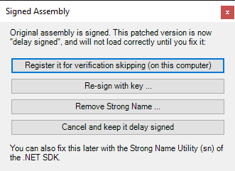

# PS Module unable to retrieve a registered custom provider

## Microsoft Code
Initial code from the Microsoft.SqlServer.Management.AlwaysEncrypted.Management.dll: 
```CSharp
public static class AlwaysEncryptedManagement {
    private static SqlColumnEncryptionKeyStoreProvider GetProvider(string providerName)
    {
        switch (providerName)
        {
        case "MSSQL_CERTIFICATE_STORE":
            return new SqlColumnEncryptionCertificateStoreProvider();
        case "MSSQL_CSP_PROVIDER":
            return new SqlColumnEncryptionCspProvider();
        case "MSSQL_CNG_STORE":
            return new SqlColumnEncryptionCngProvider();
        case "AZURE_KEY_VAULT":
        {
            if (CustomProviders.TryGetValue("AZURE_KEY_VAULT", out SqlColumnEncryptionKeyStoreProvider value))
            {
                return value;
            }
            string message = string.Format(CultureInfo.CurrentUICulture, ManagementResources.AkvProviderNotRegisteredTemplate, "AZURE_KEY_VAULT");
            throw new InvalidOperationException(message);
        }
        default:
            throw new InvalidOperationException(string.Format(CultureInfo.CurrentUICulture, ManagementResources.UnsupportedKeyStoreProviderTemplate, providerName));
        }
    }
}
```

The main issue in this code is the default statement. Only an error is returned whenever you attempt to access a custom provider. Normally the code should behave as in the the "AZURE_KEY_VAULT" statement.

With the original code, it is impossible to achieve Always Encrypted configuration with PowerShell and a custom/generic provider. It may be possible with a full C# or Java, but all the documentation use PowerShell.

## Patched DLL

The [provided patched DLL](bin/Microsoft.SqlServer.Management.AlwaysEncrypted.Management.dll) replace the Microsoft original code with the following simple code. I was not really able to properly insert IL to replace only the default statement from the original code. But it doesn't have any importance, being able to retrieve a custom/generic provider is sufficient.

I used ILSpy + Reflexil to achieve this.

- C# :
```CSharp
private static SqlColumnEncryptionKeyStoreProvider GetProvider(string providerName)
{
	if (!CustomProviders.TryGetValue(providerName, out SqlColumnEncryptionKeyStoreProvider value))
	{
		goto IL_000f;
	}
	goto IL_000f;
	IL_000f:
	return value;
}
```

- IL:
<div style="font-size:0.8em">

|Offset	|OpCode	|Operand|
|-------|-------|-------|
|0	    |call	|System.Collections.Generic.Dictionary`2<System.String,System.Data.SqlClient.SqlColumnEncryptionKeyStoreProvider> Microsoft.SqlServer.Management.AlwaysEncrypted.Management.AlwaysEncryptedManagement::get_CustomProviders()|
|5	    |ldarg.0|	|
|6	    |ldloca.s  |-> (0) (System.Data.SqlClient.SqlColumnEncryptionKeyStoreProvider)|
|8	    |callvirt  |System.Boolean System.Collections.Generic.Dictionary`2<System.String,System.Data.SqlClient.SqlColumnEncryptionKeyStoreProvider>::TryGetValue(!0,!1&)|
|13	    |ldloc.0|	|
|14	    |ret	||
</div>

## Bypass Strong Name checking

By updating the IL Code from the original DLL, the SqlServer PowerShell module doesn't allow anymore you to load this assembly.

There is 2 solutions for this:
- Update by yourself the IL code, and while saving the modified DLL Reflexil will prompt to "Register it for verification skipping" :<br />


- Use the already patched [System.Management.SQLServer.Management.dll](bin/Microsoft.SqlServer.Management.AlwaysEncrypted.Management.dll), and register the assembly to bypass Strong Name checking (using the sn.exe utility of the .NET SDK). The sn.exe utility is provided with the .NET Framework. Check a path like this one, depending the version of the .NET Framework installed "C:\Program Files (x86)\Microsoft SDKs\Windows\v8.1A\bin\NETFX 4.5.1 Tools".<br />
Below are the following commands to:
  - Enable the CLR policy for bypass Strong Name verification
  - Register the DLL for bypass Strong Name verification for all users

 Commands
```Cmd
rem Find the sn tool in your .NET Framewrok SDK (path may be different on your host).
cd "C:\Program Files (x86)\Microsoft SDKs\Windows\v8.1A\bin\NETFX 4.5.1 Tools"
rem Check your CLR policy for Bypass Strong Name verification
sn -Pb
rem Enable Bypass Strong Name verification
sn -Pb y
rem Register the DLL for strong name verification skipping
sn -Vr "Microsoft.SqlServer.Management.AlwaysEncrypted.Management,89845DCD8080CC91" AllUsers
rem Check the DLL registration
sn -Vl
```

Commands Result
```
Microsoft (R) .NET Framework Strong Name Utility  Version 4.0.30319.33440
Copyright (c) Microsoft Corporation.  All rights reserved.

Trusted applications may bypass strong name verification on this machine.

Microsoft (R) .NET Framework Strong Name Utility  Version 4.0.30319.33440
Copyright (c) Microsoft Corporation.  All rights reserved.

Verification entry added for assembly 'Microsoft.SqlServer.Management.AlwaysEncrypted.Management,89845DCD8080CC91'


Microsoft (R) .NET Framework Strong Name Utility  Version 4.0.30319.33440
Copyright (c) Microsoft Corporation.  All rights reserved.

Assembly/Strong Name                  Users
===========================================
Microsoft.SqlServer.Management.AlwaysEncrypted.Management,89845DCD8080CC91 AllUsers
```
